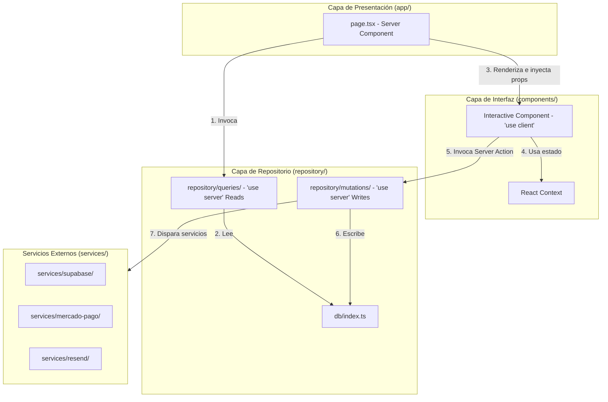

# Arquitectura de Código — Hardy App

Este documento define las capas arquitectónicas del proyecto, sus responsabilidades y cómo fluyen los datos en la aplicación. La arquitectura está diseñada bajo el principio de **Separación de Responsabilidades (Separation of Concerns)** para asegurar modularidad, mantenibilidad y escalabilidad.

---

## Estructura de Capas

La aplicación se divide en las siguientes capas y carpetas principales:

```
hardy-app/
├── app/                  # Capa de Presentación y Ruteo (Next.js Capabilities)
├── components/           # Capa de Interfaz de Usuario y React (Client/Interactive UI)
├── db/                   # Capa de Base de Datos (Esquema, Conexión y Migraciones)
│   ├── migrations/       # Migraciones SQL generadas por Drizzle
│   ├── index.ts          # Cliente/Singleton de Drizzle ORM
│   └── schema.ts         # Definición de tablas y relaciones de la base de datos
├── repository/           # Capa de Repositorio de Datos (Lógica de acceso a DB)
│   ├── queries/          # Lecturas de base de datos (Read-only Repository)
│   └── mutations/        # Acciones/Mutaciones de base de datos (Write-only Repository)
├── services/             # Capa de Servicios Externos (Integraciones y APIs de terceros)
├── consts/               # Capa de Configuración y Catálogos Estáticos
└── types/                # Capa de Tipado Global Compartido
```

---

## 1. Capa de Presentación y Ruteo: `app/`
Esta capa está reservada exclusivamente para las funcionalidades nativas de **Next.js** (Ruteo basado en archivos, middleware, layouts, control de errores y carga).

- **Páginas (`page.tsx`):**
  - **Obligatoriedad de Server Components:** Está terminantemente prohibido marcar archivos `page.tsx` con la directiva `'use client'`. Todas las páginas son Server Components por defecto.
  - **Fetch de Datos:** Las páginas actúan como orquestadores. Consumen funciones de la capa de repositorios (`repository/queries/`) y pasan los datos estructurados a los componentes de la UI como props simples.
  - **Sin Queries Directas:** Ninguna página puede importar de `@/db` ni realizar consultas SQL/Drizzle de forma directa.
- **Layouts (`layout.tsx`) y Route Groups (`(ecommerce)`, `(portal)`, `(auth)`):**
  - Definen la estructura visual global, navegación común y guards de acceso (por ejemplo, validar auth en portal).

---

## 2. Capa de Interfaz de Usuario: `components/`
Contiene la representación visual de la aplicación. Es la única capa que maneja interactividad y la biblioteca React directamente.

- **Componentes de UI y de Dominio:**
  - Componentes generales (`components/ui/`), componentes estructurales (`components/layout/`), y componentes funcionales específicos de dominio (`components/store/`, `components/portal/`).
- **Client Components (`'use client'`):**
  - Se utilizan únicamente cuando se requiere interactividad del navegador (ej. hooks como `useState`, `useEffect`, `useRef`, event handlers como `onClick`, o uso de APIs del browser).
- **Contextos de React (`components/contexts/`):**
  - Manejo de estado global puramente en el cliente (como `cart-context.tsx`). Solo viven en esta carpeta.
- **Sin acceso a base de datos o lógica pesada de servidor:** No importan herramientas de base de datos ni ejecutan queries directas.

---

## 3. Capa de Repositorio de Datos: `repository/`
Centraliza toda la interacción con la base de datos (Drizzle ORM). Actúa como la única fuente de verdad para la manipulación y lectura de los datos de la aplicación.

- **`db/index.ts`:**
  - Establece e inicializa la conexión con PostgreSQL a través de Drizzle. Actúa como cliente singleton `@/db`.
- **Lecturas (`repository/queries/`):**
  - Archivos TypeScript puros con la directiva `'use server'` en la cabecera.
  - Encapsulan todas las lecturas (`db.query.*` y `db.select()`).
  - Retornan datos tipados listos para ser consumidos por la capa de presentación.
- **Escrituras (`repository/mutations/`):**
  - Archivos TypeScript puros con la directiva `'use server'` en la cabecera.
  - Representan las Server Actions de Next.js para inserciones, actualizaciones y eliminaciones lógicas (soft deletes).
  - Manejan la validación de entrada de datos, lógica de negocio y revalidación de caché (`revalidatePath`, `revalidateTag`).

---

## 4. Capa de Servicios Externos: `services/`
Aísla las dependencias con APIs y SDKs de terceros para que un cambio en un proveedor externo no impacte las capas internas de la aplicación.

- **Supabase (`services/supabase/`):**
  - Configuración y wrappers para la creación de clientes cliente/servidor de Supabase, autenticación de usuarios y middleware de sesión.
- **Resend (`services/resend/`):**
  - Wrapper para envío de correos electrónicos y plantillas de emails.
- **Mercado Pago (`services/mercado-pago/`):**
  - Creación de preferencias de pago, webhooks e integración con Mercado Pago SDK.

---

## 5. Capa de Constantes y Catálogos: `consts/`
Contiene la información de negocio estática que no cambia dinámicamente o que funciona como catálogo inicial.
- Ejemplos: Lista estática de productos (`products.ts`), recetas (`recetas.ts`), etiquetas y nombres de roles (`roles.ts`), y constantes bancarias o de negocio (`hardy.ts`).

---

## Flujo de Datos Arquitectónico

El flujo de información en la aplicación es unidireccional y respeta estrictamente los límites de cada capa:



### Reglas Críticas de Dependencia:
1. **La UI no habla con Drizzle:** Componentes y páginas no pueden importar Drizzle schemas ni `@/db`.
2. **Las páginas no mutan directamente:** Cualquier cambio de estado se realiza a través de las Server Actions en `repository/mutations/`.
3. **Servicios son autocontenidos:** Los módulos dentro de `services/` no deben acoplarse con la lógica de UI ni renderizar JSX.
